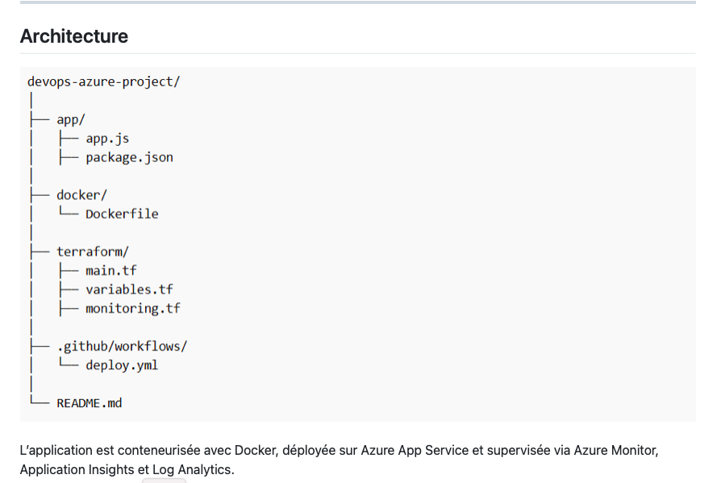

## DevOps Azure Project – CI/CD, Terraform & Monitoring

## Description

Ce projet met en œuvre une chaîne DevOps complète sur Microsoft Azure, incluant déploiement automatisé, Infrastructure as Code, conteneurisation et monitoring applicatif.

Il démontre une approche professionnelle de mise en production d’une application cloud-native avec supervision et observabilité.

---

## Stack technique

- **Node.js / Express**
- **Docker**
- **GitHub Actions (CI/CD)**
- **Terraform (Infrastructure as Code)**
- **Microsoft Azure**
  - Azure App Service
  - Application Insights
  - Log Analytics Workspace
  - Azure Monitor

---

## Architecture

L’application est conteneurisée avec Docker, déployée sur Azure App Service et supervisée via Azure Monitor, Application Insights et Log Analytics.

---

## Fonctionnalités principales

- Déploiement automatisé sur Azure
- Infrastructure as Code avec Terraform
- Pipeline CI/CD GitHub Actions
- Monitoring et observabilité applicative
- Centralisation des logs
- Alerting Azure Monitor
- Health check applicatif

---

## Prérequis

Avant de commencer :

- Un compte Azure
- Azure CLI installé
- Terraform installé
- Docker installé
- Node.js installé
- Un dépôt GitHub

## Lancer l’application en local

cd app
npm install
npm run dev

---

Accès :

- http://localhost:3000
- http://localhost:3000/health

## Docker

Construire l’image :
- docker build -t devops-app -f docker/Dockerfile .

Lancer le conteneur :
- docker run -p 3000:3000 devops-app

## Déployer l’infrastructure Azure avec Terraform

- cd terraform
- terraform init
- terraform plan
- terraform apply

Ressources crées :

- Resource Group
- App Service Plan
- Linux Web App
- Application Insights
- Log Analytics Workspace
- Azure Monitor Alerts

## Configurer GitHub Actions

Dans GitHub :

ouvrir le dépôt

- aller dans Settings > Secrets and variables > Actions

ajouter le secret :
- AZURE_WEBAPP_PUBLISH_PROFILE

Ce secret contient le Publish Profile de l’application Azure.

## CI/CD

À chaque push sur la branche main, le pipeline exécute :

- checkout du code
- installation des dépendances
- lancement des tests
- build Docker
- déploiement Azure

## Monitoring complet

Application Insights : permet de suivre :

- requêtes HTTP
- temps de réponse
- erreurs et exceptions
- événements personnalisés
- traces applications

Log Analytics Workspace : centralise les logs et métriques Azure.

Azure Monitor Alerts : des alertes sont configurées sur :

- CPU élevée
- temps de réponse trop long
- disponibilité faible

Healthcheck : L’endpoint /health permet à Azure de vérifier que l’application répond correctement.

Exemple :

curl http://localhost:3000/health

Réponse attendue :

{
  "status": "UP",
  "timestamp": "2026-03-30T10:00:00.000Z"
}

Tester les erreurs : pour tester la remontée d’erreurs dans Application Insights :

- GET /error-test

## Vérifications après déploiement

Dans Azure Portal, vérifier :

- Web App disponible
- Health check actif
- Application Insights connecté
- Logs visibles
- alertes créées
- métriques collectées

## Améliorations possibles

- tests unitaires réels avec Jest
- déploiement multi-environnements (dev / prod)
- dashboards Azure Monitor
- Gestion des secrets via Azure Key Vault
- Azure Container Registry
- Kubernetes avec AKS

👨‍💻 Auteur

Fischer KOUEBENA BANKAZI
- Ingénieure Cloud AZURE
